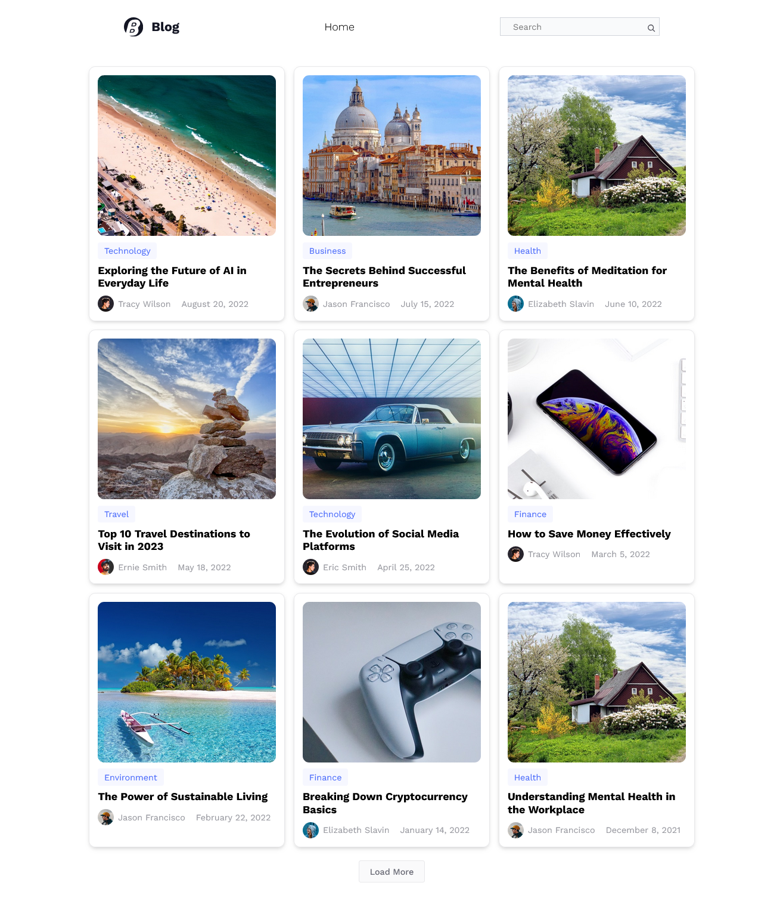
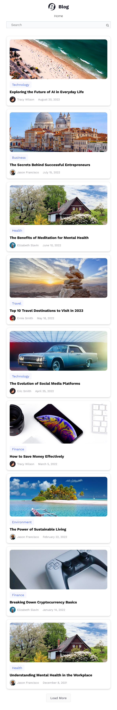
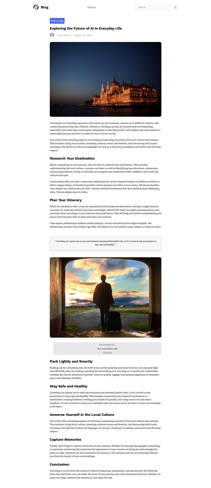

# Blog App

**Blog App** is a responsive application built with React.js. It allows users to explore blog posts seamlessly, offering a smooth and engaging experience.

## Features

- **Dynamic Navigation**: Utilizes React Router for seamless transitions between pages.
- **Static Data Integration**: Fetches blog posts from a `data.json` file to dynamically display content.
- **Article Display**: Blog posts are presented in an interactive card format, showcasing titles, categories, authors, and publication dates.
- **Load More Functionality**: Allows users to expand the visible posts and reset to the default view with intuitive "Load More" and "Show Less" buttons.
- **Error Handling**: Features a custom 404 error page with clear messaging and a "Back to Homepage" link.
- **Responsive Design**: Adapts seamlessly to both desktop and mobile devices.

## Technologies Used

- **React.js**: Core framework for building reusable components and user interfaces.
- **React Router**: Manages dynamic navigation between application pages.
- **CSS**: Ensures modern and polished styling for responsive layouts.
- **JSON**: Serves as a source for static data integration.

## Screenshots

### Desktop View



### Mobile View



### Post View



## Live Demo

[Live Demo](https://mohddh.github.io/blogapp/)

## How to Run the Project

1. Clone the repository to your local machine:

   ```bash
   git clone https://github.com/MohDDH/BlogApp.git
   ```

2. Move into the project directory:

   ```bash
   cd BlogApp
   ```

3. Install the required dependencies:

   ```bash
   npm install
   ```

4. Start the development server:
   ```bash
   npm start
   ```

## Learning Milestone

This project reflects the following key learnings:

- Proficiency in **React Router** to create dynamic and efficient navigation.
- Integration of **static data** from JSON files to render content dynamically.
- Enhanced understanding of responsive web design, ensuring usability across devices.
- Strengthened skills in building interactive and user-friendly interfaces with React.

## Acknowledgments

Special thanks to [ALMDRASA](https://almdrasa.com/) Platform for their guidance and support during Frontend Development Courses.🌹
